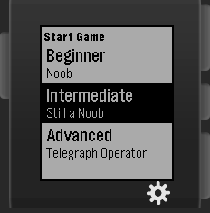
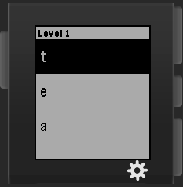
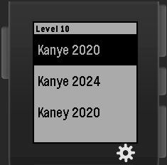
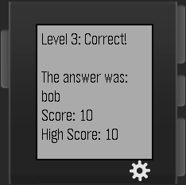
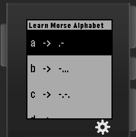

# Pebble-Morse

Pebble-Morse is a simple game that helps people learn Morse Code while having lots of fun. It is a standalone Pebble Watchapp and does not need a mobile companion application.

Pebble-Morse has 3 levels of difficulty, each having 10 stages.

At each stage, the player receives a series of vibrations, representing either a letter, a word, or an expression in Morse Code. The player will then try to select the correct answer from a list of 3 options.

The harder the level is, the faster the vibration pattern is played. The stages within a level also have increasingly longer and more complex patterns to recognize. 

The player gets 10 points for each correct response, and 0 for an incorrect one.
A local high score is kept in the app to show the player's progress.

To help the players learn, the app also has a reference page that shows the pattern for every letter in the English alphabet.

#Authors

Ze Qian Zhang, Mathieu Wang, Cheng Gong
